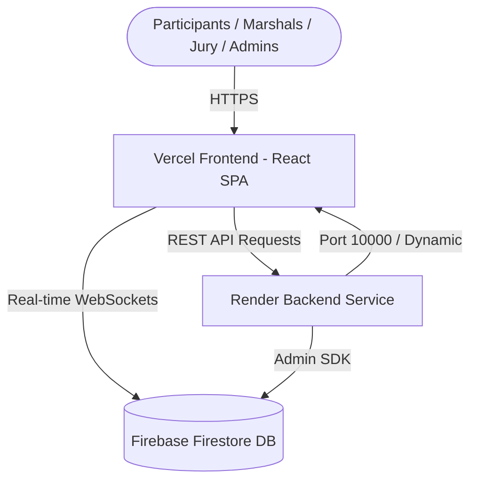

# 🚀 WEBX COMMAND — Complete Production Deployment Guide

This guide walks you through deploying the **WEBX COMMAND** platform:
- **Backend**: Hosted on [Render](https://render.com) (Node.js REST API + Firestore sync engine)
- **Frontend**: Hosted on [Vercel](https://vercel.com) (Vite React SPA with client-side routing)
- **Database & Auth**: Google Cloud Firebase / Firestore

---

## 📋 Architecture Overview



---

## 🛠️ Part 1: Deploy Backend to Render

### Step 1.1: Create Render Web Service
1. Log in to your [Render Dashboard](https://dashboard.render.com/).
2. Click **New +** in the top navigation and select **Web Service**.
3. Under **Connect a repository**, choose **GitHub** and select:
   ```
   bkchaithanya285/webx-hub
   ```

### Step 1.2: Configure Service Settings
Fill in the deployment parameters:

| Field | Value | Notes |
| :--- | :--- | :--- |
| **Name** | `webx-command-backend` | Or any preferred service name |
| **Region** | `Singapore (Southeast Asia)` / `Frankfurt` | Pick closest to event venue |
| **Branch** | `main` | Production branch |
| **Root Directory** | `backend` | **Crucial**: points to backend folder |
| **Runtime** | `Node` | Node.js runtime |
| **Build Command** | `npm install && npm run build` | Compiles TypeScript to `lib/` |
| **Start Command** | `npm start` | Executes `node lib/index.js` |
| **Instance Type** | `Free` | Zero cost tier |

### Step 1.3: Add Environment Variables in Render
Scroll to the **Environment Variables** section on Render and add:

```env
NODE_VERSION=18.20.4
PORT=10000
```

### Step 1.4: Deploy & Copy Backend URL
1. Click **Create Web Service**.
2. Wait 1–2 minutes for the build and startup log to display:
   ```
   [WEBX COMMAND BACKEND] Server running on http://localhost:10000
   ```
3. Copy your live Render URL from top left (e.g. `https://webx-command-backend.onrender.com`).

---

## ⚡ Part 2: Deploy Frontend to Vercel

### Step 2.1: Import Project on Vercel
1. Go to [Vercel Dashboard](https://vercel.com/new).
2. Click **Import** next to your GitHub repository:
   ```
   bkchaithanya285/webx-hub
   ```

### Step 2.2: Configure Build & Output
Vercel will auto-detect Vite:
- **Framework Preset**: `Vite`
- **Root Directory**: `./` (leave default)
- **Build Command**: `npm run build`
- **Output Directory**: `dist`
- **Install Command**: `npm install`

### Step 2.3: Set Environment Variables in Vercel
Under **Environment Variables**, add:

| Key | Value | Description |
| :--- | :--- | :--- |
| `VITE_BACKEND_URL` | `https://webx-command-backend.onrender.com` | **Your live Render URL from Part 1** |

> [!IMPORTANT]
> Do not include a trailing slash in `VITE_BACKEND_URL` (e.g., use `https://webx-command-backend.onrender.com`, not `.../`).

### Step 2.4: Deploy Frontend
1. Click **Deploy**.
2. Deployment completes in ~30–45 seconds.
3. Vercel will output your live URL (e.g. `https://webx-hub.vercel.app`).

---

## 🔒 Part 3: Deploy Firebase Security Rules (Optional / Recommended)

To ensure Firestore database rules are enforced:
```powershell
# 1. Login to Firebase CLI
firebase login

# 2. Deploy Firestore Rules
firebase deploy --only firestore:rules
```

---

## 🧪 Post-Deployment Verification Checklist

Verify all portals are functional on your live Vercel domain:

- [ ] **Public Landing Page** (`/`): Loads title card, rules, countdown, and 32 problem statements with detailed specifications.
- [ ] **Spec Download**: Click *Download Spec (.JSON)* on any problem statement drawer.
- [ ] **Team Portal** (`/team`): Log in with `WEB-001` / Password: Team Lead Reg No (`9924005189`).
- [ ] **Admin Portal** (`/admin`): Log in with `bkrishnachaitanya285@gmail.com` via Google Sign-In.
- [ ] **Problem Selection Allocation Limit**: Check that PS cards and Admin modal enforce the 2-teams capacity rule.
- [ ] **Volunteer Scanner** (`/volunteer`): Check QR camera scanner and verify check-in submissions.
- [ ] **Reviewer Jury Portal** (`/reviewer`): Verify score evaluation, live leaderboard ranking, and auto-normalization.

---

## 🆘 Troubleshooting & Common Fixes

| Issue | Cause | Solution |
| :--- | :--- | :--- |
| **Vercel 404 on page refresh** | SPA route rewrite missing | Handled automatically by [`vercel.json`](./vercel.json). |
| **Render spin-down delay (Free Tier)** | Inactivity sleep after 15 mins | Frontend automatically operates with resilient Firestore fallback if backend is waking up. |
| **CORS errors in console** | Origin mismatch | Backend has wildcard CORS (`cors()`) enabled to accept requests from all Vercel subdomains. |

---

*WEBX COMMAND — Crafted for CSI KARE Student Chapter Hackathon 2026.*
